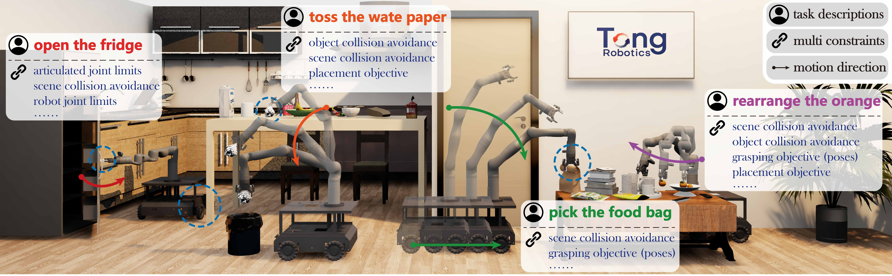

# M²Diffuser: Diffusion-based Trajectory Optimization for Mobile Manipulation in 3D Scenes

**IEEE Transactions on Pattern Analysis and Machine Intelligence (T-PAMI) 2025**

<p align="left">
    <a href='https://m2diffuser.github.io/assets/paper/M2Diffuser.pdf'>
      
    </a>
    <a href='https://arxiv.org/pdf/2410.11402'>
      
    </a>
    <a href='https://m2diffuser.github.io/'>
      
    </a>
    <a href='https://youtu.be/T7kpDifRtfk?si=-R5agRpDM4uJKtuz' target='_blank'>
      
    </a>
    <a href='https://b23.tv/avOmoz0'>
      
    </a>
    <a href='https://huggingface.co/datasets/M2Diffuser/mec_kinova_mobile_manipulation/tree/main'>
      
    </a>
</p>

[Sixu Yan](https://sixu-yan.github.io)<sup>1,2</sup>,
[Zeyu Zhang](https://zeyuzhang.com/)<sup>2</sup>,
[Muzhi Han](https://sites.google.com/view/muzhihan)<sup>3</sup>,
Zaijin Wang<sup>2</sup>,
[Qi Xie](https://github.com/sudoku77/)<sup>2</sup>,
Zhitian Li<sup>2,4</sup>,
Zhehan Li<sup>2,5</sup>,
[Hangxin Liu](https://liuhx111.github.io/)<sup>2</sup>,
[Xinggang Wang](https://xwcv.github.io/)<sup>1</sup>,
[Song-Chun Zhu](https://zhusongchun.net/)<sup>2,6,7</sup>

Corresponding authors: Xinggang Wang (xgwang@hust.edu.cn) and Hangxin Liu (liuhx@bigai.ai)

<sup>1 </sup>HUST,
<sup>2 </sup>BIGAI,
<sup>3 </sup>UCLA,
<sup>4 </sup>BUAA,
<sup>5 </sup>XDU,
<sup>6 </sup>PKU,
<sup>7 </sup>THU




## Install Environment
To reproduce our simulation results, please install your conda environment on a Linux machine equipped with an NVIDIA GPU. M2Diffuser is developed with Python 3.8.18 and has only been tested on Ubuntu 20.04.

We recommend using the same CUDA and PyTorch versions as ours (PyTorch 1.13.1 with CUDA 11.6) for compatibility. If you choose to use different versions, please make sure to adjust the corresponding versions of `pytorch-lightning` and `kaolin` in the environment configuration `./setup_env.sh` accordingly.
```bash
./setup_env.sh
```
Modify the `yourdfpy/urdf.py` file in the yourdfpy package by editing lines `1240–1244`.
```python
# delete the original code in the file and replace it with the code below
new_s = new_s.scaled([geometry.mesh.scale[0], geometry.mesh.scale[1], geometry.mesh.scale[2]])
```

## Download URDF and USD Files
Please download the robot and scene models, including:
- [URDF](https://huggingface.co/datasets/M2Diffuser/mec_kinova_mobile_manipulation/blob/main/agent_urdf.zip) and [USD](https://huggingface.co/datasets/M2Diffuser/mec_kinova_mobile_manipulation/blob/main/agent_usd.zip) files of the robots
- [URDF](https://huggingface.co/datasets/M2Diffuser/mec_kinova_mobile_manipulation/blob/main/physcene_urdf.zip) and [USD](https://huggingface.co/datasets/M2Diffuser/mec_kinova_mobile_manipulation/blob/main/physcene_usd.zip) files of the scenes

After downloading, please unzip and place the URDF files of the robots and scenes into the `${your_urdf_model_path}` directory, and update the corresponding paths in `utils/path.py` according to your actual directory structure. The directory path of USD files will be introduced in [here](#evaluate-models).

## Pre-process Dataset
Please download and unzip our [pre-processed dataset](https://huggingface.co/datasets/M2Diffuser/mec_kinova_mobile_manipulation/blob/main/dataset.zip), which is pre-processed to be used for model training. It includes three mobile manipulation tasks: `pick`, `place`, and `goal-reach`. The dataset directory is organized as follows:
```bash
${your_dataset_path}}/
├── pick/
│   ├── 0.npy
│   ├── 1.npy
│   └── ...
├── place/
│   ├── 0.npy
│   ├── 1.npy
│   └── ...
├── goal-reach/
│   ├── 0.npy
│   ├── 1.npy
│   └── ...
```
> Note: for details about the data structure in the `.npy` files, please refer to the comments in `./preprocessing/data_preprocess_pick.py` and `./preprocessing/data_preprocess_place.py` that describe their data components.

Alternatively, you may download the [original data](https://huggingface.co/datasets/M2Diffuser/mec_kinova_mobile_manipulation/blob/main/original_data.zip) and process it yourself. The data is generated by our previous work—[M3Bench](https://zeyuzhang.com/papers/m3bench/) and [VKC](https://github.com/zyjiao4728/Planning-on-VKC), and includes two tasks: `pick` and `place`. Note that the `goal-reach` task reuses the processed `pick` data, as described in our paper. The original data directory is organized as follow:
```bash
${your_original_data_path}/
├── pick/
│   ├── ${physcene_name}/
│   │   ├── ${object_link_name}
│   │   │   ├── ${time_stamp}
│   │   │   │   ├── env_config.json
│   │   │   │   ├── ${pick_exp_id}
│   │   │   │   │   ├── config.json
│   │   │   │   │   ├── pick_vkc_return.json
│   │   │   │   │   ├── vkc_request.json
│   │   │   │   │   └── trajectory
│   │   │   │   │       ├── pick_action_relativity.json
│   │   │   │   │       ├── pick_trajectory_absolute.json
│   │   │   │   │       ├── pick_trajectory_relativity.json
│   │   │   │   │       └── pick_vkc_caption_trajectory.json
│   │   │   │   └── ...
│   │   │   └── ...
│   │   └── ...
│   └── ...
├── place/
│   ├── ${physcene_name}/
│   │   ├── ${object_link_name}
│   │   │   ├── ${time_stamp}_place
│   │   │   │   ├── env_config.json
│   │   │   │   ├── ${place_exp_id}
│   │   │   │   │   ├── config.json
│   │   │   │   │   ├── place_vkc_return.json
│   │   │   │   │   ├── vkc_request.json
│   │   │   │   │   └── trajectory
│   │   │   │   │       ├── place_action_relativity.json
│   │   │   │   │       ├── place_trajectory_absolute.json
│   │   │   │   │       ├── place_trajectory_relativity.json
│   │   │   │   │       └── place_vkc_caption_trajectory.json
│   │   │   │   └── ...
│   │   │   └── ...
│   │   └── ...
│   └── ...
```

The code for processing the original data is as follows:

```bash
# pre-process pick data
python data_preprocess_pick.py --robot MecKinova --task pick --origin_path ${your_original_data_path}/pick --save_path ${your_dataset_path}} --overwrite

# pre-process place data
python data_preprocess_place.py --robot MecKinova --task place --origin_path ${your_original_data_path}/place --save_path ${your_dataset_path}} --overwrite

# pre-process the goal-reach data, simply copy the processed `pick` data and rename the directory to `goal-reach`.
```
> **Note:** make sure to update the corresponding data paths in the YAML files under the `configs/task` directory, such as `data_dir: ${your_dataset_path}/${task.type}`.

## Train Models
Train M2Diffuser, MPiNets, and MPiFormer on the mobile manipulation dataset using the following code. Our codebase supports both single-GPU and multi-GPU training.
- M2Diffuser training
```bash
bash ./scripts/model-m2diffuser/${task_type}/train.sh ${GPU_NUM}
# e.g., bash ./scripts/model-m2diffuser/pick/train.sh 1
```
- MPiNets training
```bash
bash ./scripts/model-mpinets/${task_type}/train.sh ${GPU_NUM}
```
- MPiFormer training
```bash
bash ./scripts/model-mpiformer/${task_type}/train.sh ${GPU_NUM}
```
All trained model checkpoints are saved in the `./checkpoints` folder by default. You can also modify the `output_dir: checkpoints` field in `./configs/default.yaml` to change the checkpoint saving path.

## Evaluate Models
Use the following code to evaluate M2Diffuser, MPiNets, and MPiFormer on the mobile manipulation dataset. The evaluation includes: (1) testing physical feasibility (e.g., collision, smoothness) in PyBullet, and (2) verifying task success (e.g., grasping and placement) in NVIDIA Isaac Sim.

You can either use your own trained checkpoints or download our [pre-trained models](https://huggingface.co/datasets/M2Diffuser/mec_kinova_mobile_manipulation/blob/main/checkpoints.zip) and unzip them into a folder, e.g., `./checkpoints/`.

task|checkpoints|desc
-|-|-
MK-M2Diffuser-Pick|2024-06-28-20-36-17|M2Diffuser trained on `pick` data
MK-M2Diffuser-Place|2024-07-21-22-54-33|M2Diffuser trained on `place` data
MK-M2Diffuser-Goal-Reach|2024-07-14-09-38-10|M2Diffuser trained on `goal-reach` data
MK-MPiNets-Pick|2024-07-07-09-16-52|MPiNets trained on `pick` data
MK-MPiNets-Place|2024-07-25-09-30-12|MPiNets trained on `place` data
MK-MPiNets-Goal-Reach|2024-07-10-16-04-41|MPiNets trained on `goal-reach` data
MK-MPiFormer-Pick|2024-07-14-10-20-36|MPiFormers trained on `pick` data
MK-MPiFormer-Place|2024-07-23-19-15-15|MPiFormers trained on `place` data
MK-MPiFormer-Goal-Reach|2024-08-01-18-50-33|MPiFormers trained on `goal-reach` data

### 1. Evaluatation in PyBullet
Our evaluation in the PyBullet environment focuses on assessing whether the trajectories generated by different models adhere to physical constraints, including collision rate, joint violations, and trajectory smoothness.

- M2Diffuser evaluation
```bash
bash ./scripts/model-m2diffuser/${task_type}/inference.sh ${CKPT_PATH}
```
> **Note:** By default, M2Diffuser is evaluated with trajectory optimization enabled. To evaluate M2Diffuser without trajectory optimization, please comment out the lines containing `planner` and `optimizer` in `./scripts/model-m2diffuser/${task_type}/inference.sh`. Here, `planner` and `optimizer` correspond to the `cost` and `energy` functions described in the [paper](https://arxiv.org/pdf/2410.11402), respectively.

- MPiNets evaluation
```bash
bash ./scripts/model-mpinets/${task_type}/inference.sh ${CKPT_PATH}
```

- MPiFormer evaluation
```bash
bash ./scripts/model-mpiformer/${task_type}/inference.sh ${CKPT_PATH}
```

To enable visualization of the evaluation results, set `task.environment.viz` to `true` in `./scripts/model-${model_name}/${task_type}/inference.sh`. When you run the script, it will print a URL that you can open in a browser on the host machine to view the scene and the robot.

All evaluation results are saved in the `./results directory`, which follows the structure below. The file `all.json` contains aggregated evaluation results across all trajectories. The file `${task_type}_${object_name}.json` stores results for trajectories involving the same object within a specific task type, and `${id}.json` records the evaluation result of each individual trajectory.
```bash
./results/
├── mk_${model_name}_${task_type}/
│   ├── ${time_stamp}
│   │   ├── all
│   │   │   └── all.json
│   │   ├── group
│   │   │   ├── ${task_type}_${object_name}.json
│   │   │   └── ...
│   │   └── object
│   │       ├── ${id}.json
│   │       └── ...
│   └── ...
└── ...
```

### 2. Evaluatation in NVIDIA Isaac Sim
To evaluate task success rates in NVIDIA Isaac Sim, a separate conda environment needs to be created. The evaluation code should then be run within this environment to compute the task success rates.
- Install Tongverse
```bash
cd ${your_workspace}
git clone ...
```

Additionally, please unzip and place the USD files of the robots and scenes into the `${your_workspace}/Tongverse` directory. Of note, this path is hardcoded and does not support custom configuration.

- Evaluate Tasks (`pick` and `place`)
```bash
cd ${your_workspace}/Tongverse/tv_evaluate
python evaluate_${task_type}.py --result_dir ${your_workspace}/m2diffuser/results/${task_type}/${time_stamp} --dataset_test_dir ${your_dataset_path}/${task_type}/test 
```

The evaluation results from NVIDIA Isaac Sim will be saved to `${your_workspace}/m2diffuser/results/${task_type}/${time_stamp}/eval_res_${new_time_stamp}.json`. The `${new_time_stamp}` suffix is used to prevent repeated evaluations from overwriting previous results.

### 3. Results Summary
Aggregate and summarize the evaluation results from PyBullet and NVIDIA Isaac Sim. When selecting the evaluation file from NVIDIA Isaac Sim, remove the `${new_time_stamp}` suffix to obtain the standardized filename: `${your_workspace}/m2diffuser/results/${task_type}/${time_stamp}/eval_res.json`.

Switch back to the `m2diffuser` conda environment and run the following code:

```bash
conda activate m2diffuser
cd ${your_workspace}/postprocessing
python eval_all_result_${task_type}_dataset.py --result_dir ../../results_dataset/${task_type}/${timestamp} --dataset_test_dir ${your_dataset_path}/${task_type}/test
```

The aggregated evaluation results will be saved in the file `${your_workspace}/m2diffuser/results/${task_type}/${time_stamp}/eval_metrics.json`. The evaluation metrics recorded in this file are as follows:

```
${object_name}: {
    "% Success": xxx,
    "Number": xxx,
    "% With Environment Collision": xxx,
    "% With Self Collision": xxx,
    "% With Joint Limit Violations": xxx,
    "Average Collision Depth (cm)": xxx,
    "Median Collision Depth (cm)": xxx,
    "Average Config SPARC": xxx,
    "Average End Eff SPARC": xxx,
    "% Smooth": xxx,
    "Average End Eff Position Path Length": xxx,
    "Average End Eff Orientation Path Length": xxx,
    "Average Time": xxx,
    "Average Time Per Step (Not Always Valuable)": xxx
},
...
```


## TODO List
- [x] Release mobile manipulation dataset  
- [x] Release model checkpoints
- [ ] Release the evaluation code in NVIDIA Isaac Sim

## Citations
**M2Diffuser**
```
@article{yan2025m2diffuser,
  title={M2Diffuser: Diffusion-based Trajectory Optimization for Mobile Manipulation in 3D Scenes},
  author={Yan, Sixu and Zhang, Zeyu and Han, Muzhi and Wang, Zaijin and Xie, Qi and Li, Zhitian and Li, Zhehan and Liu, Hangxin and Wang, Xinggang and Zhu, Song-Chun},
  journal={IEEE Transactions on Pattern Analysis and Machine Intelligence},
  year={2025},
  publisher={IEEE}
}
```

**M3Bench**
```
@article{zhang2025m3bench,
  title={M${}^{3}$Bench: Benchmarking Whole-Body Motion Generation for Mobile Manipulation in 3D Scenes},
  author={Zhang, Zeyu and Yan, Sixu and Han, Muzhi and Wang, Zaijin and Wang, Xinggang and Zhu, Song-Chun and Liu, Hangxin},
  journal={IEEE Robotics and Automation Letters},
  year={2025},
  volume={10},
  number={7},
  pages={7286-7293},
  publisher={IEEE}
}
```

**VKC**
```
@inproceedings{jiao2021efficient,
  title={Efficient task planning for mobile manipulation: a virtual kinematic chain perspective},
  author={Jiao, Ziyuan and Zhang, Zeyu and Wang, Weiqi and Han, David and Zhu, Song-Chun and Zhu, Yixin and Liu, Hangxin},
  booktitle={2021 IEEE/RSJ International Conference on Intelligent Robots and Systems (IROS)},
  pages={8288--8294},
  year={2021},
  organization={IEEE}
}
```
```
@inproceedings{jiao2021consolidating,
  title={Consolidating kinematic models to promote coordinated mobile manipulations},
  author={Jiao, Ziyuan and Zhang, Zeyu and Jiang, Xin and Han, David and Zhu, Song-Chun and Zhu, Yixin and Liu, Hangxin},
  booktitle={2021 IEEE/RSJ International Conference on Intelligent Robots and Systems (IROS)},
  pages={979--985},
  year={2021},
  organization={IEEE}
}
```

## Acknowledgments

Some codes are borrowed from [SceneDiffuser](https://github.com/scenediffuser/Scene-Diffuser/), [MPiNets](https://github.com/NVlabs/motion-policy-networks), [Decision Transformer](https://github.com/kzl/decision-transformer), [VKC](https://github.com/zyjiao4728/Planning-on-VKC), and [PhyScene](https://github.com/PhyScene/PhyScene).

## License
This repository is released under the MIT license. See [LICENSE](LICENSE) for additional details.
